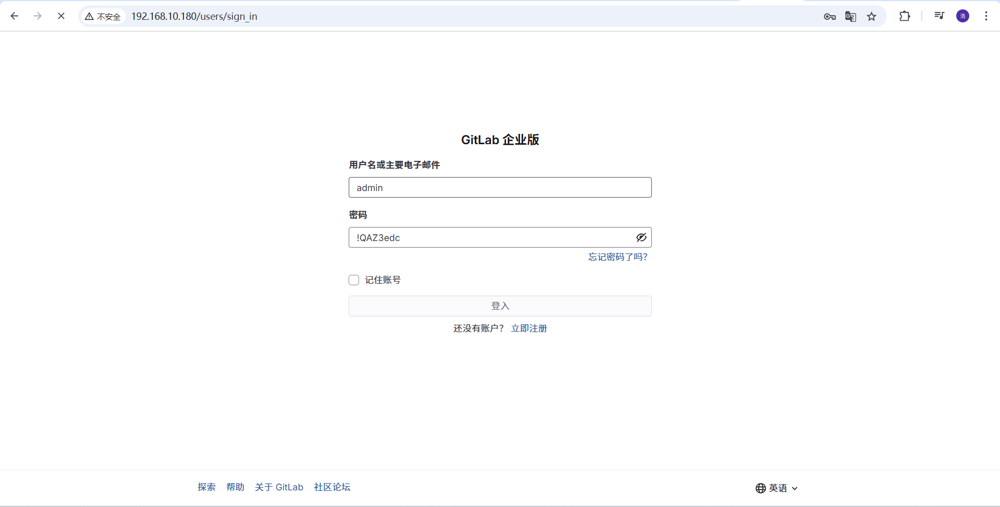

## 📝 gitlab安装
`环境说明`
- ubuntu-20.04

### 🧱 一、GitLab 安装部署方式选择
| 部署方式                 | 说明                                         | 
| -------------------- | ------------------------------------------ | 
| ✅ 官方 Omnibus 安装包（推荐） | 一键安装 GitLab 所有组件（PostgreSQL、Redis、Nginx 等） | 
| Docker 安装            | 使用镜像部署 GitLab，轻量但需注意数据挂载和端口                |
| Kubernetes 部署        | 适用于企业级集群集成                                 | 

### 📦 二、GitLab 安装步骤
#### ✅ 1. 添加镜像源和安装依赖
```
sudo apt update && sudo apt upgrade -y
sudo apt install -y curl openssh-server ca-certificates tzdata perl vim
```
#### ✅ 2. 添加 GitLab 安装源
```
curl https://packages.gitlab.com/install/repositories/gitlab/gitlab-ee/script.deb.sh | sudo bash
```
> 注：gitlab-ee = 企业版，功能最全，免费使用核心功能

#### ✅ 3. 安装 GitLab
```
sudo EXTERNAL_URL="http://your-server-ip" apt install gitlab-ee
```
`替换 your-server-ip 为实际 IP 或域名（建议使用内网/局域网 IP 以避免公网安全问题）`

#### ✅ 4. 启动并访问 GitLab
```
sudo gitlab-ctl reconfigure
```
`访问：http://your-server-ip，首次登录会提示设置 root 密码。`

### 🛠 三、基础配置建议
#### 1. 设置 Hostname 和邮箱
修改配置文件：
```
sudo vim /etc/gitlab/gitlab.rb
修改以下项：

external_url 'http://your-server-ip'
gitlab_rails['gitlab_email_from'] = 'gitlab@yourdomain.com'

然后重新生效配置：
sudo gitlab-ctl reconfigure
```
#### 2. 创建新用户与项目
- 登录 GitLab Web 界面；
- 创建一个新的 Group 和 Project；
- 设置 SSH 公钥（~/.ssh/id_rsa.pub）到个人账户；
- 本地测试 clone / push / pull 是否正常。

#### 3. 安装中文语言包
登录 GitLab > 用户设置 > Preferences > Language 选择简体中文。

### 📋 四、常用命令速查
```
# 查看状态
sudo gitlab-ctl status

# 启动/停止
sudo gitlab-ctl start
sudo gitlab-ctl stop

# 重启 & 重载配置
sudo gitlab-ctl restart
sudo gitlab-ctl reconfigure

# 查看日志
sudo gitlab-ctl tail
```