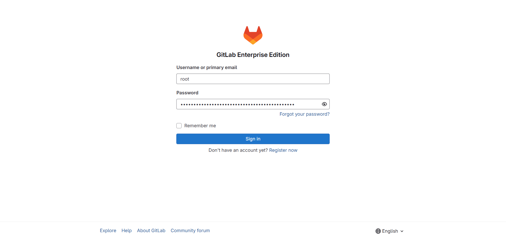
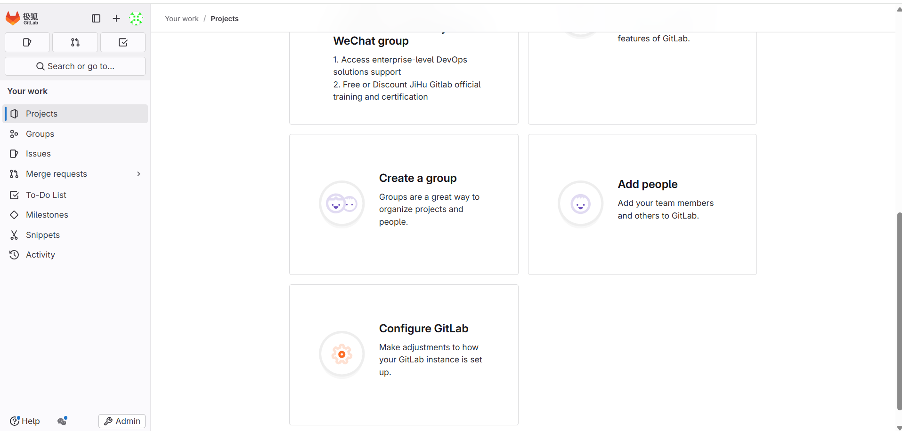
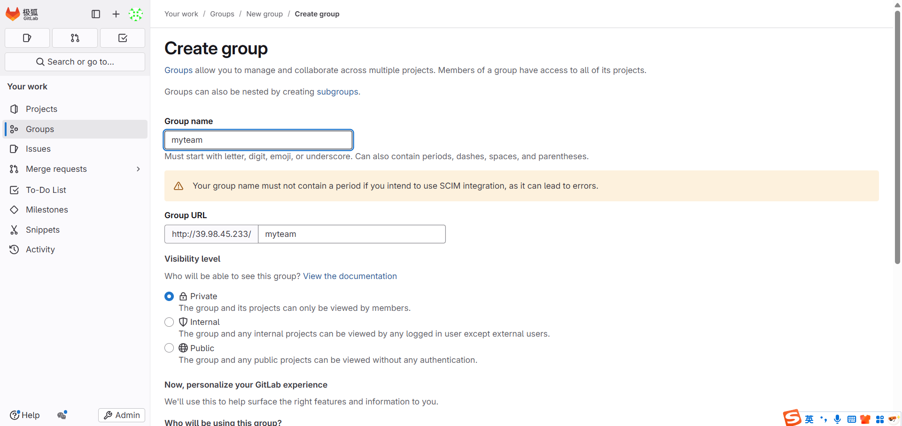
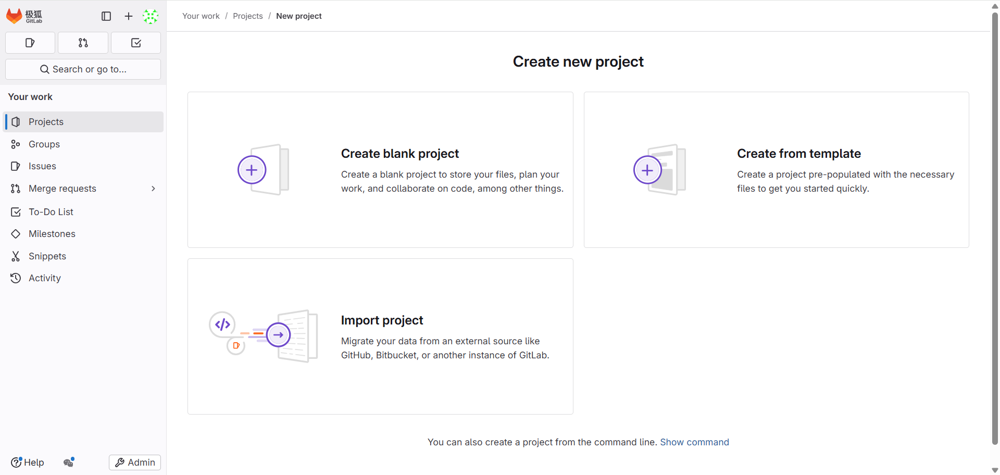
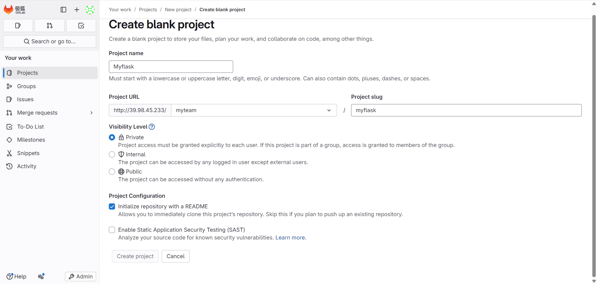
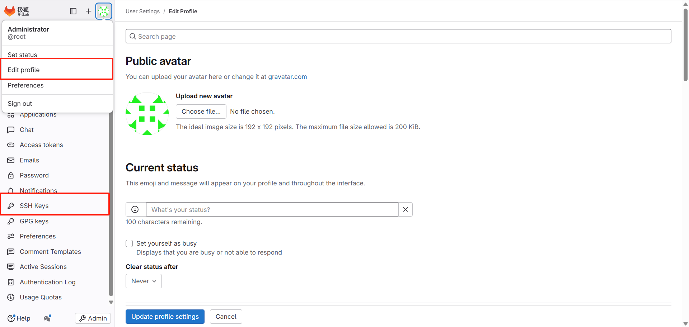
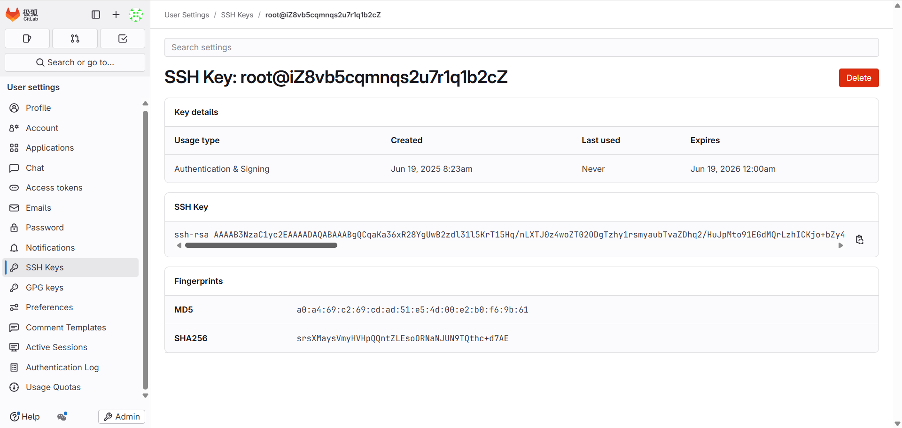
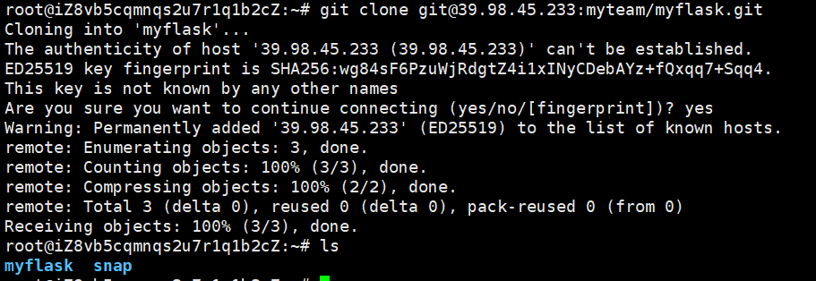

## 🚀 gitlab安装 
> gitlab 官方文档：https://gitlab.cn/docs/

- `环境说明: ubuntu-20.04`

### 🧱 一、GitLab 安装部署方式选择
| 部署方式                 | 说明                                         | 
| -------------------- | ------------------------------------------ | 
| ✅ 官方 Omnibus 安装包（推荐） | 一键安装 GitLab 所有组件（PostgreSQL、Redis、Nginx 等） | 
| Docker 安装            | 使用镜像部署 GitLab，轻量但需注意数据挂载和端口                |
| Kubernetes 部署        | 适用于企业级集群集成                                 | 

### 📦 二、GitLab 安装步骤
#### ✅ 1. 添加镜像源和安装依赖
```
sudo apt update && sudo apt upgrade -y
sudo apt install -y curl openssh-server ca-certificates tzdata perl vim git 
```
#### ✅ 2. 添加 GitLab 安装源
```
curl -fsSL https://packages.gitlab.cn/repository/raw/scripts/setup.sh | /bin/bash
```
#### ✅ 3. 安装 GitLab
```
sudo GITLAB_ROOT_PASSWORD="<strongpassword>" EXTERNAL_URL="your-server-ip " apt install gitlab-jh
```
`替换 your-server-ip 为实际 IP 或域名（建议使用内网/局域网 IP 以避免公网安全问题）`
`替换<strongpassword>为实际的root登录密码`

#### ✅ 4. 启动并访问 GitLab
```
sudo gitlab-ctl reconfigure
```
`访问：http://your-server-ip，首次登录会提示设置 root 密码。 root密码的存储位置：/etc/gitlab/initial_root_password`

### 🛠 三、基础配置建议
#### 1. 设置 Hostname 和邮箱
修改配置文件：
```
sudo vim /etc/gitlab/gitlab.rb
修改以下项：

external_url 'http://your-server-ip'
gitlab_rails['gitlab_email_from'] = 'gitlab@yourdomain.com'

然后重新生效配置：
sudo gitlab-ctl reconfigure
```
#### 2. 创建新用户与项目
- 登录 GitLab Web 界面，使用root用户登录；
- 创建一个新的 Group；
- 创建一个新的 Project；
- 设置 SSH 公钥（~/.ssh/id_rsa.pub）到个人账户；
  - 本地测试 clone / push / pull  是否正常。


#### 3. 安装中文语言包
登录 GitLab > 用户设置 > Preferences > Language 选择简体中文。

### 📋 四、常用命令速查
```
# 查看状态
sudo gitlab-ctl status

# 启动/停止
sudo gitlab-ctl start
sudo gitlab-ctl stop

# 重启 & 重载配置
sudo gitlab-ctl restart
sudo gitlab-ctl reconfigure

# 查看日志
sudo gitlab-ctl tail
```