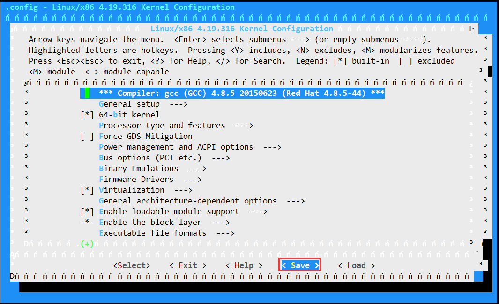

### 📝 内核升级

`参考文档：https://www.cnblogs.com/zhangwencheng/p/18252574`

#### 环境说明
`最小化安装 CentOS-7-x86_64-Minimal-1804.iso`

```
[root@localhost-01 ~]# cat /etc/redhat-release
CentOS Linux release 7.5.1804 (Core) 
[root@localhost-01 ~]# uname -r
3.10.0-862.el7.x86_64
```

#### 1.小版本升级
```
使用yum升级内核
# 查看当前和可升级版本
[root@localhost-01 ~]# yum list kernel | grep kernel
Repodata is over 2 weeks old. Install yum-cron Or run: yum makecache fast
kernel.x86_64                  3.10.0-862.el7                          @anaconda
kernel.x86_64                  3.10.0-1160.119.1.el7                   @updates
 
# 小版本升级（3.10.0-862.el7 --> 3.10.0-1160.119.1.el7 ）
[root@localhost-01 ~]# yum update kernel -y
 
# 验证
[root@localhost-01 ~]# cat /etc/redhat-release
CentOS Linux release 7.5.1804 (Core)
 
[root@localhost-01 ~]# uname -r
3.10.0-1160.119.1.el7.x86_64
```

#### 2.大版本升级
`内核下载地址`  
`kernel官方地址：https://www.kernel.org/`   
`kernel内核下载地址：http://mirrors.coreix.net/elrepo-archive-archive/kernel/el7/x86_64/RPMS/ `   
`kernel清华源下载地址：https://mirrors.tuna.tsinghua.edu.cn/centos-vault/altarch/7.9.2009/kernel/x86_64/Packages/`  
`kernel阿里云下载地址：https://mirrors.aliyun.com/elrepo/archive/kernel/el7/x86_64/RPMS/`  
`kernel【5.X】下载地址：https://mirrors.coreix.net/elrepo-archive-archive/kernel/el7/x86_64/RPMS/`  
`kernel【4.X】下载地址：https://buildlogs.centos.org/c7-kernels.x86_64/kernel/20200330213326/4.19.113-300.el8.x86_64/`  

`内核种类：`  
* kernel-ml：ml是英文【mainline stable】的缩写，最新的稳定主线版本
* kernel-lt：lt是英文【long term support】的缩写，长期支持版本

```
ElRepo公钥：https://elrepo.org/wiki/doku.php?id=start
版本生命周期：https://www.kernel.org/category/releases.html

# 系统信息
[root@localhost-01 ~]# cat /etc/redhat-release
CentOS Linux release 7.5.1804 (Core)
[root@localhost-01 ~]# uname -r
3.10.0-862.el7.x86_64

# 更新yum仓库
# 如果只更新软件包可执行：yum -y update --exclude=kernel*
[root@localhost-01 ~]# yum -y update


# 当前内核信息
[root@localhost-01 ~]# rpm -qa | grep kernel
kernel-3.10.0-1160.119.1.el7.x86_64
kernel-tools-libs-3.10.0-1160.119.1.el7.x86_64
kernel-tools-3.10.0-1160.119.1.el7.x86_64
kernel-3.10.0-862.el7.x86_64

# 由于ELRepo仓库的不再支持 CentOS 7 ,只能手动下载需要版本rpm包，这里选择安装版本（kernel-lt-5.4.278）
[root@localhost-01 ~]# wget http://mirrors.coreix.net/elrepo-archive-archive/kernel/el7/x86_64/RPMS/kernel-lt-5.4.278-1.el7.elrepo.x86_64.rpm
[root@localhost-01 ~]# wget http://mirrors.coreix.net/elrepo-archive-archive/kernel/el7/x86_64/RPMS/kernel-lt-devel-5.4.278-1.el7.elrepo.x86_64.rpm
[root@localhost-01 ~]# wget http://mirrors.coreix.net/elrepo-archive-archive/kernel/el7/x86_64/RPMS/kernel-lt-headers-5.4.278-1.el7.elrepo.x86_64.rpm
[root@localhost-01 ~]# wget http://mirrors.coreix.net/elrepo-archive-archive/kernel/el7/x86_64/RPMS/kernel-lt-tools-5.4.278-1.el7.elrepo.x86_64.rpm
[root@localhost-01 ~]# wget http://mirrors.coreix.net/elrepo-archive-archive/kernel/el7/x86_64/RPMS/kernel-lt-tools-libs-5.4.278-1.el7.elrepo.x86_64.rpm
[root@localhost-01 ~]# wget http://mirrors.coreix.net/elrepo-archive-archive/kernel/el7/x86_64/RPMS/kernel-lt-doc-5.4.278-1.el7.elrepo.noarch.rpm

[root@localhost-01 ~]# yum localinstall kernel-lt-*

# 若安装提示冲突，则卸载旧版本tools
[root@localhost-01 ~]# yum remove kernel-tools-libs-3.10.0-1160.119.1.el7.x86_64 kernel-tools-3.10.0-1160.119.1.el7.x86_64

# 查看当前默认内核启动
[root@localhost-01 ~]# grub2-editenv list
saved_entry=CentOS Linux (3.10.0-1160.119.1.el7.x86_64) 7 (Core)

# 查看当前内核启动可选项
[root@localhost-01 ~]# awk -F\' '$1=="menuentry " {print i++ " : " $2}' /etc/grub2.cfg
0 : CentOS Linux (5.4.278-1.el7.elrepo.x86_64) 7 (Core)
1 : CentOS Linux (3.10.0-1160.119.1.el7.x86_64) 7 (Core)
2 : CentOS Linux (3.10.0-862.el7.x86_64) 7 (Core)
3 : CentOS Linux (0-rescue-c4ad8cdbfdb44ce190f1c662815d35f4) 7 (Core)

# 修改默认启动顺序
[root@localhost-01 ~]# ls -l /etc/grub2.cfg
lrwxrwxrwx 1 root root 22 Jun 17 15:23 /etc/grub2.cfg -> ../boot/grub2/grub.cfg

[root@localhost-01 ~]# grub2-set-default 'CentOS Linux (5.4.278-1.el7.elrepo.x86_64) 7 (Core)'
[root@localhost-01 ~]# grub2-editenv list
saved_entry=CentOS Linux (5.4.278-1.el7.elrepo.x86_64) 7 (Core)
 或【推荐使用如下方式进行配置变更】
[root@localhost-01 ~]# grub2-set-default 0
[root@localhost-01 ~]# grub2-editenv list
saved_entry=0

# 重启生效
[root@localhost-01 ~]# reboot

# 验证结果
[root@localhost-01 ~]# cat /etc/redhat-release
CentOS Linux release 7.9.2009 (Core)
[root@localhost-01 ~]# uname -r
5.4.278-1.el7.elrepo.x86_64
```

#### 3.删除旧版本内核（可选）
```
[root@localhost-01 ~]# rpm -qa | grep kernel
kernel-lt-5.4.278-1.el7.elrepo.x86_64
kernel-lt-tools-5.4.278-1.el7.elrepo.x86_64
kernel-3.10.0-1160.119.1.el7.x86_64
kernel-3.10.0-862.el7.x86_64
kernel-lt-tools-libs-5.4.278-1.el7.elrepo.x86_64

[root@localhost-01 ~]# yum remove kernel-3.10.0-862.el7.x86_64 kernel-3.10.0-1160.119.1.el7.x86_64
```

#### 4.源码编译安装升级至指定版本
`源码清华源地址：https://mirror.tuna.tsinghua.edu.cn/kernel/v4.x/`  
`linux-4.xx.xx.tar.xz`  
`linux-4.xx.xx.tar.gz`    

```
# 准备编译环境
[root@localhost ~]# yum install -y gcc make git ctags ncurses-devel openssl-devel
[root@localhost ~]# yum install -y bison flex elfutils-libelf-devel bc wget

# 下载内核源码，并解压缩
[root@localhost ~]# wget https://mirror.tuna.tsinghua.edu.cn/kernel/v4.x/linux-4.19.316.tar.xz
[root@localhost ~]# tar -xf linux-4.19.316.tar.xz
[root@localhost ~]# cd linux-4.19.316
[root@localhost linux-4.19.316]# make clean && make mrproper

#步骤AB，二选一执行
#(可选步骤A： 也可通过现有内核参数去生成新的配置参数文件.config)
[root@localhost linux-4.19.316]# cp /boot/config-3.10.0-1160.el7.x86_64 ./.config
[root@localhost linux-4.19.316]# make oldconfig     （长按回车：保持默认）

#(可选步骤B： 可直接通过menuconfig 增减内核模块或组件，选择后可查看.config参数文件的更新情况)
[root@localhost linux-4.19.316]# make menuconfig
```

如不修改，则按Tab键至<Save>回车，下一步选择<Exit>


```
# 编译内核
[root@localhost linux-4.19.316]# make -j 4 all

# 说明：
# -j 4: 将使用4核CPU资源去编译内核（grep 'processor' /proc/cpuinfo | sort -u | wc -l）
# all: 编译所有选择模块

# 安装内核
[root@localhost linux-4.19.316]# make modules_install install

# 查看当前内核启动可选项
[root@localhost ~]# awk -F\' '$1=="menuentry " {print i++ " : " $2}' /etc/grub2.cfg
0 : CentOS Linux (4.19.316) 7 (Core)
1 : CentOS Linux (3.10.0-862.el7.x86_64) 7 (Core)
2 : CentOS Linux (0-rescue-49ac73bb3441491996c90d9285ffbc3d) 7 (Core)

# 修改默认启动顺序
[root@localhost ~]# grub2-set-default 'CentOS Linux (4.19.316) 7 (Core)'
[root@localhost ~]# grub2-editenv list
saved_entry=CentOS Linux (4.19.316) 7 (Core)
 或
[root@localhost ~]# grub2-set-default 0
[root@localhost ~]# grub2-editenv list
saved_entry=0

# 重启生效
[root@localhost ~]# reboot

# 验证结果
[root@localhost ~]# cat /etc/redhat-release
CentOS Linux release 7.9.2009 (Core)
[root@localhost ~]# uname -r
4.19.316
```