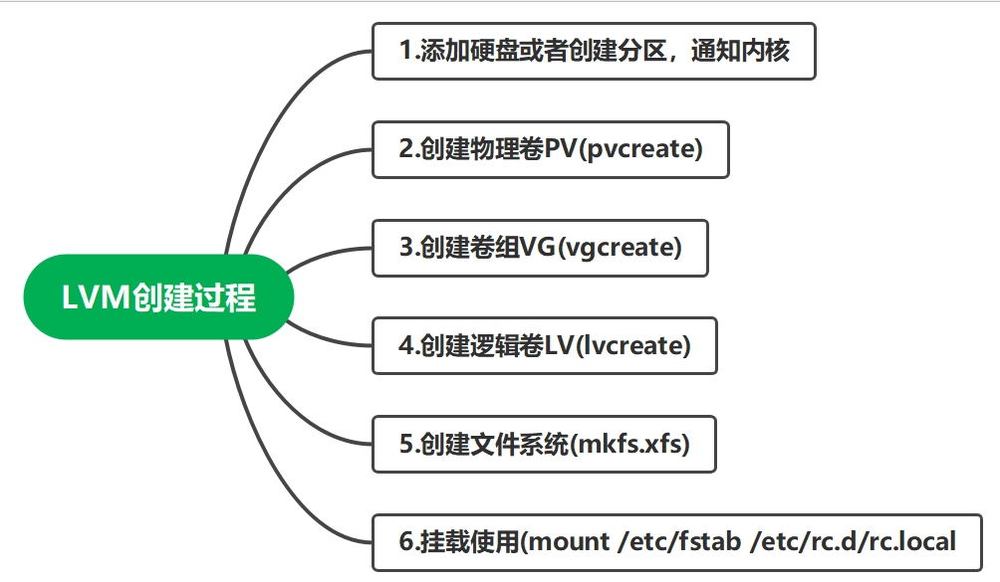

### 📝 创建逻辑卷

`思路：`

1. 物理的设备
2. 将物理设备做成物理卷
3. 创建卷组并将物理卷加入其中
4. 创建逻辑卷
5. 格式化逻辑卷
6. 挂载使用

#### 1.准备好物理设备，sdb、sdc硬盘

```shell
[root@uos01 ~]# lsblk /dev/sd[b,c]
NAME MAJ:MIN RM SIZE RO TYPE MOUNTPOINT
sdb    8:16   0  10G  0 disk 
sdc    8:32   0  10G  0 disk 
```

#### 2.创建物理卷

```shell
[root@uos01 ~]# pvcreate /dev/sdb /dev/sdc
  Physical volume "/dev/sdb" successfully created.
  Physical volume "/dev/sdc" successfully created.

查看物理卷
[root@uos01 ~]# pvs
  PV         VG  Fmt  Attr PSize   PFree 
  /dev/sda3  uos lvm2 a--  <23.50g     0 
  /dev/sdb       lvm2 ---   10.00g 10.00g
  /dev/sdc       lvm2 ---   10.00g 10.00g

查看详细信息
[root@uos01 ~]# pvdisplay /dev/sdb
  "/dev/sdb" is a new physical volume of "10.00 GiB"
  --- NEW Physical volume ---
  PV Name               /dev/sdb
  VG Name               
  PV Size               10.00 GiB
  Allocatable           NO
  PE Size               0   
  Total PE              0
  Free PE               0
  Allocated PE          0
  PV UUID               ujZ7N1-pZ2p-e6UK-k9vL-XspG-Gw0H-kA7Tmp
[root@uos01 ~]# pvdisplay /dev/sdc
  "/dev/sdc" is a new physical volume of "10.00 GiB"
  --- NEW Physical volume ---
  PV Name               /dev/sdc
  VG Name               
  PV Size               10.00 GiB
  Allocatable           NO
  PE Size               0   
  Total PE              0
  Free PE               0
  Allocated PE          0
  PV UUID               RJridM-pc1m-OCG2-c5Vu-a2RH-NfdU-vQCI8k
```

#### 3.创建卷组myvg01，加入物理卷PV

```shell
[root@uos01 ~]# vgcreate myvg01 /dev/sdb /dev/sdc
  Volume group "myvg01" successfully created

查看卷组信息
[root@uos01 ~]# vgs myvg01 
  VG     #PV #LV #SN Attr   VSize  VFree 
  myvg01   2   0   0 wz--n- 19.99g 19.99g
[root@uos01 ~]# vgdisplay myvg01 
  --- Volume group ---
  VG Name               myvg01
  System ID             
  Format                lvm2
  Metadata Areas        2
  Metadata Sequence No  1
  VG Access             read/write
  VG Status             resizable
  MAX LV                0
  Cur LV                0
  Open LV               0
  Max PV                0
  Cur PV                2
  Act PV                2
  VG Size               19.99 GiB
  PE Size               4.00 MiB
  Total PE              5118
  Alloc PE / Size       0 / 0   
  Free  PE / Size       5118 / 19.99 GiB
  VG UUID               S4cFUe-cvEZ-RQZa-cSCS-PzA9-3ARB-gXZwoG
```

#### 4.创建逻辑卷

`参数解释`

- -n：指定逻辑卷的名字
- -L：指定逻辑卷的大小
- -l：指定逻辑卷的大小
- 举例：
- -l 100            100个PE，每个PE大小默认4M，故逻辑卷大小为400M
- -l 50%free        卷组剩余空间的50%
- -L 5G             创建大小为5GB的逻辑卷

```shell
创建逻辑卷mylv01
[root@uos01 ~]# lvcreate -n mylv01 -L 5G myvg01 
  Logical volume "mylv01" created.

查看逻辑卷信息
[root@uos01 ~]# lvs /dev/myvg01/mylv01 
  LV     VG     Attr       LSize Pool Origin Data%  Meta%  Move Log Cpy%Sync Convert
  mylv01 myvg01 -wi-a----- 5.00g    
[root@uos01 ~]# lvdisplay /dev/myvg01/mylv01 
  --- Logical volume ---
  LV Path                /dev/myvg01/mylv01
  LV Name                mylv01
  VG Name                myvg01
  LV UUID                8923dl-0uCR-Fox1-aJKY-c3IQ-d62K-EKjR7J
  LV Write Access        read/write
  LV Creation host, time uos01, 2024-08-28 16:09:14 +0800
  LV Status              available
  # open                 0
  LV Size                5.00 GiB
  Current LE             1280
  Segments               1
  Allocation             inherit
  Read ahead sectors     auto

  - currently set to     8192
    Block device           253:3

可以在系统中的两个地方，找到lv分区信息
[root@uos01 ~]# ll /dev/mapper/myvg01-mylv01 
lrwxrwxrwx 1 root root 7  8月 28 16:09 /dev/mapper/myvg01-mylv01 -> ../dm-3
[root@uos01 ~]# ll /dev/myvg01/mylv01 
lrwxrwxrwx 1 root root 7  8月 28 16:09 /dev/myvg01/mylv01 -> ../dm-3

查看卷组还剩余多少空间
[root@uos01 ~]# vgs myvg01 
  VG     #PV #LV #SN Attr   VSize  VFree 
  myvg01   2   1   0 wz--n- 19.99g 14.99g

再创建一个200M的逻辑卷mylv02，每个LE默认4M，用-l 100 参数指定100个LE，因此是400M
[root@uos01 ~]# lvcreate -n mylv02 -l 100 myvg01
  Logical volume "mylv02" created.

查看mylv02大小
[root@uos01 ~]# lvs /dev/myvg01/mylv02
  LV     VG     Attr       LSize   Pool Origin Data%  Meta%  Move Log Cpy%Sync Convert
  mylv02 myvg01 -wi-a----- 400.00m     

查看myvg01剩余大小
[root@uos01 ~]# vgs myvg01 
  VG     #PV #LV #SN Attr   VSize  VFree 
  myvg01   2   2   0 wz--n- 19.99g 14.60g

创建卷组剩余空间的50%，逻辑卷mylv03
[root@uos01 ~]# lvcreate -n mylv03 -l 50%free myvg01
  Logical volume "mylv03" created.

查看mylv03
[root@uos01 ~]# lvs /dev/myvg01/mylv03
  LV     VG     Attr       LSize Pool Origin Data%  Meta%  Move Log Cpy%Sync Convert
  mylv03 myvg01 -wi-a----- 7.30g 

查看此时vg剩余
[root@uos01 ~]# vgs myvg01 
  VG     #PV #LV #SN Attr   VSize  VFree
  myvg01   2   3   0 wz--n- 19.99g 7.30g
```

#### 5.格式化逻辑卷mylv01

```shell
[root@uos01 ~]# mkfs.xfs /dev/myvg01/mylv01
meta-data=/dev/myvg01/mylv01     isize=512    agcount=4, agsize=327680 blks
         =                       sectsz=512   attr=2, projid32bit=1
         =                       crc=1        finobt=1, sparse=1, rmapbt=0
         =                       reflink=1
data     =                       bsize=4096   blocks=1310720, imaxpct=25
         =                       sunit=0      swidth=0 blks
naming   =version 2              bsize=4096   ascii-ci=0, ftype=1
log      =internal log           bsize=4096   blocks=2560, version=2
         =                       sectsz=512   sunit=0 blks, lazy-count=1
realtime =none                   extsz=4096   blocks=0, rtextents=0
Discarding blocks...Done.
```

#### 6.挂载逻辑卷使用

```shell
[root@uos01 ~]# mkdir /funlyp-lv01
[root@uos01 ~]# mount /dev/myvg01/mylv01 /funlyp-lv01/
[root@uos01 ~]# df -Th | grep funlyp
/dev/mapper/myvg01-mylv01 xfs       5.0G   68M  5.0G    2% /funlyp-lv01

写入数据
[root@uos01 ~]# touch /funlyp-lv01/lvm实践操作.log
[root@uos01 ~]# ls /funlyp-lv01/
lvm实践操作.log
```

