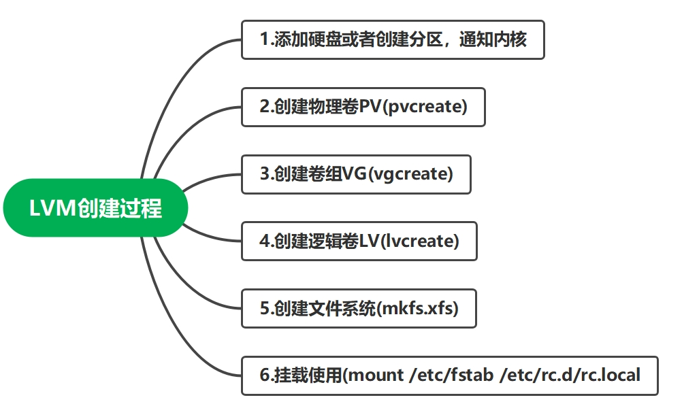

### 📝 lvm动态扩容



`思路：`

1. 查看该挂载点，对应的逻辑卷是哪一个/dev/mapper/vg01-lv01
2. 查看该逻辑卷所在的卷组，是否还有剩余空间。
3. 如果vg01空间不够，就得先扩容卷组，再扩容逻辑卷
4. 如果vg01空间足够，直接扩容逻辑卷

#### 直接扩容逻辑卷

##### 1.查看挂载点，属于哪个逻辑卷
```shell
[root@uos01 ~]*# df -Th | grep funlyp*
/dev/mapper/myvg01-mylv01 xfs       5.0G   68M  5.0G    2% /funlyp-lv01
```

##### 2.查看逻辑卷大小
```shell
[root@uos01 ~]# lvs /dev/mapper/myvg01-mylv01
  LV     VG     Attr       LSize Pool Origin Data%  Meta%  Move Log Cpy%Sync Convert
  mylv01 myvg01 -wi-ao---- 5.00g   
```
##### 3.查看卷组空间
```shell
[root@uos01 ~]*# vgs myvg01* 
  VG     *#PV #LV #SN Attr   VSize  VFree*
  myvg01   2   3   0 wz--n- 19.99g 7.30g
```

4.卷组空间还剩7.3G，直接扩容逻辑卷
直接扩容加5G
```shell
[root@uos01 ~]*# lvextend -L +5G /dev/myvg01/mylv01*
  Size of logical volume myvg01/mylv01 changed from 5.00 GiB (1280 extents) to 10.00 GiB (2560 extents).
  Logical volume myvg01/mylv01 successfully resized.

查看扩容结果
[root@uos01 ~]*# df -Th | grep funlyp*
/dev/mapper/myvg01-mylv01 xfs       5.0G   68M  5.0G    2% /funlyp-lv01

发现容量未更新
同步文件系统，使其容量更新，只针对xfs
[root@uos01 ~]*# xfs_growfs /dev/myvg01/mylv01*
meta-data=/dev/mapper/myvg01-mylv01 isize=512    agcount=4, agsize=327680 blks
​         =                       sectsz=512   attr=2, projid32bit=1
​         =                       crc=1        finobt=1, sparse=1, rmapbt=0
​         =                       reflink=1
data     =                       bsize=4096   blocks=1310720, imaxpct=25
​         =                       sunit=0      swidth=0 blks
naming   =version 2              bsize=4096   ascii-ci=0, ftype=1
log      =internal log           bsize=4096   blocks=2560, version=2
​         =                       sectsz=512   sunit=0 blks, lazy-count=1
realtime =none                   extsz=4096   blocks=0, rtextents=0
data blocks changed from 1310720 to 2621440

再次查看扩容结果
[root@uos01 ~]*# df -Th | grep funlyp*
/dev/mapper/myvg01-mylv01 xfs        10G  104M  9.9G    2% /funlyp-lv01
```
> `xfs文件系统只支持增大分区空间的情况，不支持减小的情况（切记！！！！！）`
> `硬要减小的话，只能在减小后将逻辑分区重新通过mkfs.xfs命令重新格式化才能挂载上，这样的话这个逻辑分区上原来的数据就丢失了。`
> `可以选择用ext4文件系统，支持扩缩容`

`还是觉得逻辑卷容量太小了，想要扩容到20G`

#### 先扩容卷组，再扩容逻辑卷

##### 1.查看逻辑卷大小和卷组空间
```shell
[root@uos01 ~]*# lvs /dev/mapper/myvg01-mylv01*
  LV     VG     Attr       LSize  Pool Origin Data%  Meta%  Move Log Cpy%Sync Convert
  mylv01 myvg01 -wi-ao---- 10.00g   
[root@uos01 ~]*# vgs myvg01* 
  VG     *#PV #LV #SN Attr   VSize  VFree*
  myvg01   2   3   0 wz--n- 19.99g 2.30g
```
##### 2.卷组空间已经不够支持逻辑卷扩容到20G了，得先扩容卷组
```shell
添加新硬盘sde
[root@uos01 ~]*# lsblk /dev/sde*
NAME MAJ:MIN RM SIZE RO TYPE MOUNTPOINT
sde    8:64   0  10G  0 disk 

再把sde制作成物理卷pv
[root@uos01 ~]*# pvcreate /dev/sde*
WARNING: dos signature detected on /dev/sde at offset 510. Wipe it? [y/n]: y
  Wiping dos signature on /dev/sde.
  Physical volume "/dev/sde" successfully created.

[root@uos01 ~]*# pvs*
  PV         VG     Fmt  Attr PSize   PFree 
  /dev/sda3  uos    lvm2 a--  <23.50g     0 
  /dev/sdb   myvg01 lvm2 a--  <10.00g     0 
  /dev/sdc   myvg01 lvm2 a--  <10.00g  2.30g
  /dev/sde          lvm2 ---   10.00g 10.00g

添加物理卷到卷组（卷组扩容)
[root@uos01 ~]*# vgextend myvg01 /dev/sde*
  Volume group "myvg01" successfully extended
[root@uos01 ~]*# pvs*
  PV         VG     Fmt  Attr PSize   PFree  
  /dev/sda3  uos    lvm2 a--  <23.50g      0 
  /dev/sdb   myvg01 lvm2 a--  <10.00g      0 
  /dev/sdc   myvg01 lvm2 a--  <10.00g   2.30g
  /dev/sde   myvg01 lvm2 a--  <10.00g <10.00g
```
`注意：`
`正常情况下，应该先将/dev/sde物理设备创建为物理卷再加入到卷组中；如果直接加入卷组，系统会自动帮你将其做成物理卷。`

```shell
查看扩容后的卷组
[root@uos01 ~]*# vgs myvg01* 
  VG     *#PV #LV #SN Attr   VSize   VFree*  
  myvg01   3   3   0 wz--n- <29.99g <12.30g
```
##### 3.扩容逻辑卷mylv01到20G
```shell
[root@uos01 ~]*# lvextend -L +10G /dev/myvg01/mylv01*
  Size of logical volume myvg01/mylv01 changed from 10.00 GiB (2560 extents) to 20.00 GiB (5120 extents).
  Logical volume myvg01/mylv01 successfully resized.

查看扩容后的逻辑卷
[root@uos01 ~]*# lvs /dev/myvg01/mylv01*
  LV     VG     Attr       LSize  Pool Origin Data%  Meta%  Move Log Cpy%Sync Convert
  mylv01 myvg01 -wi-ao---- 20.00g  

查看挂载目录的容量，发现还未更新
[root@uos01 ~]*# df -h | grep funlyp*
/dev/mapper/myvg01-mylv01   10G  104M  9.9G    2% /funlyp-lv01

手动更新
[root@uos01 ~]*# xfs_growfs /dev/myvg01/mylv01*
meta-data=/dev/mapper/myvg01-mylv01 isize=512    agcount=8, agsize=327680 blks
​         =                       sectsz=512   attr=2, projid32bit=1
​         =                       crc=1        finobt=1, sparse=1, rmapbt=0
​         =                       reflink=1
data     =                       bsize=4096   blocks=2621440, imaxpct=25
​         =                       sunit=0      swidth=0 blks
naming   =version 2              bsize=4096   ascii-ci=0, ftype=1
log      =internal log           bsize=4096   blocks=2560, version=2
​         =                       sectsz=512   sunit=0 blks, lazy-count=1
realtime =none                   extsz=4096   blocks=0, rtextents=0
data blocks changed from 2621440 to 5242880

再次查看已更新
[root@uos01 ~]*# df -h | grep funlyp*
/dev/mapper/myvg01-mylv01   20G  176M   20G    1% /funlyp-lv01
```